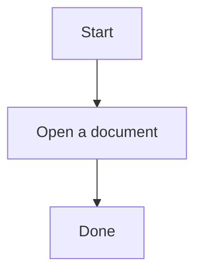

# LAN Reader · Local Network Bookshelf

**English** | [简体中文](https://github.com/zhanglei1996/lan-library-reader/blob/main/README.zh-CN.md)

[](https://github.com/zhanglei1996/lan-library-reader/actions/workflows/ci.yml)
[](https://www.npmjs.com/package/lan-reader)
[](LICENSE)
[](https://nodejs.org/)

Turn a folder of documents and source files on your computer into a browser-based bookshelf for your local network.

Run `lan-reader` inside a folder, then browse and read its documents from a computer, phone, or tablet connected to the same network. Your files stay on your computer. LAN Reader does not upload, edit, or delete them.

## Preview


## Quick start

LAN Reader requires Node.js 22.13 or newer.

### 1. Install

Install it once:

```bash
npm install -g lan-reader
```

### 2. Start

Open the folder you want to read:

```bash
cd "/Users/your-name/Documents/notes"
lan-reader
```

Or pass the folder directly:

```bash
lan-reader "/Users/your-name/Documents/notes"
```

LAN Reader starts in the background by default. The command prints the addresses and returns immediately, so you can close the terminal. Current CLI output is in Chinese:

```text
局域网书架已在后台启动（PID 12345）
本机访问：http://localhost:8080
局域网访问：http://192.168.1.20:8080
日志：/Users/your-name/.lan-library-reader/logs/lan-reader-....log
现在可以关闭当前终端。
运行 lan-reader stop 可一键停止全部书架。
```

- Open the local address on the computer running LAN Reader.
- On a phone or tablet connected to the same Wi-Fi, open the network address.
- The service keeps running after the terminal is closed.
- If several network addresses are shown, try the one on the same subnet as the mobile device.

### 3. Stop

Run this from any terminal:

```bash
lan-reader stop
```

This stops only LAN Reader services on the current computer. It does not delete or modify documents.

## Features

- Book-like reading interface with a file tree, article view, and page outline
- Responsive layout for desktop, phone, and tablet
- Markdown headings, tables, task lists, footnotes, math, callouts, syntax highlighting, Mermaid, and relative links
- Image zoom, fullscreen viewing, and original-image access
- Built-in TXT preview; configurable source/text extensions with syntax highlighting, line numbers, and wrapping
- Embedded PDF preview with zoom and byte-range requests
- Optional Word and PowerPoint preview through LibreOffice PDF conversion
- Copy full text, copy code blocks, copy a LAN link, and download the original file
- Light and dark themes, font scaling, previous/next navigation, and reading-position restoration
- Folder tree plus folder-name, filename, and full-text search
- Automatic refresh and natural sorting for Chinese filenames
- QR codes for the current document and address switching for computers with multiple network interfaces
- Background processes that can be listed and stopped together
- Non-blocking notification when a newer stable npm release is available
- Incremental branch scanning and content-index caching for large bookshelves
- Optional access code, session cookies, and login rate limiting
- Local-first operation with no cloud drive, account, or database
- Read-only safeguards against writes, path traversal, hidden files, and out-of-root symbolic links

## Supported files

| File type | Extensions | Preview |
| --- | --- | --- |
| Markdown | `.md` `.markdown` `.mdown` | Rendered web page |
| Text | `.txt` | Monospace text, line numbers, and wrapping |
| Custom text/source | Configured in `.lan-reader.json` | Safe plain text with optional syntax highlighting |
| PDF | `.pdf` | Embedded browser viewer |
| Word | `.doc` `.docx` | Converted to PDF by LibreOffice |
| PowerPoint | `.ppt` `.pptx` | Converted to PDF by LibreOffice |
| Markdown images | PNG, JPEG, GIF, WebP, AVIF, BMP, SVG | Loaded from relative paths |

Markdown, TXT, and PDF work without LibreOffice. Word and PowerPoint files still appear in the tree when LibreOffice is unavailable and can be downloaded in their original format.

Fenced code blocks marked as `mermaid` are rendered as flowcharts, sequence diagrams, and other supported diagrams. Regular code blocks remain unchanged and include a copy button:

````markdown

````

Footnotes, math, and GitHub-style callouts work directly:

```markdown
Here is a footnote[^note], and this is inline math: $E = mc^2$.

> [!TIP]
> Click a Markdown image to zoom, enter fullscreen, or open the original.

$$
\int_0^1 x^2 \, dx = \frac{1}{3}
$$

[^note]: Footnote content is collected at the end of the article.
```

Markdown files larger than approximately 64 KB are split at safe boundaries and rendered in batches while the browser is idle. Documents with cross-segment footnotes or reference definitions automatically use complete rendering so links and footnotes remain correct.

## Scanning rules

The starting folder does not need to contain a Markdown file. LAN Reader recursively looks for supported documents:

- By default, it includes Markdown, TXT, PDF, Word, and PowerPoint files at any depth.
- Other file types are not included and do not count toward the bookshelf limit unless configured in `.lan-reader.json`.
- Only directory branches containing supported documents are kept.
- Empty directories and directories containing only unsupported files are hidden.
- Hidden files, hidden directories, symbolic links, and common build directories are skipped: `node_modules`, `target`, `dist`, `build`, `out`, `coverage`, `vendor`, `bower_components`, and `__pycache__`.
- Standalone images are not shown in the tree; they are loaded when referenced by Markdown.
- A bookshelf can contain up to 20,000 default or explicitly configured documents.
- A separate traversal safety limit of 250,000 files and directories prevents accidentally scanning an entire large disk. Unconfigured source files and images may be visited while searching, but do not count as bookshelf documents.
- If a subdirectory temporarily disappears or cannot be read, LAN Reader skips it and continues scanning the rest of the bookshelf.

If no supported document is found, the service still starts with an empty bookshelf.

### Excluding directories

Create `.lan-readerignore` in the starting folder. Add one directory name or relative path per line:

```text
# Exclude this directory name at any depth
generated

# Or exclude only these paths
docs/archive/
data/large-files
```

Blank lines and lines beginning with `#` are ignored. Rules currently match exact directory names or relative paths; glob patterns are not supported. The original files are never changed.

## Project configuration: `.lan-reader.json`

`.lan-reader.json` is an optional bookshelf-level configuration file. Place it in the folder where `lan-reader` is started. Without it, the defaults are used. Each bookshelf can have its own independent configuration.

The two local configuration files serve different purposes:

- `.lan-reader.json` sets the bookshelf title, extra text types, preview behavior, and feature switches.
- `.lan-readerignore` excludes directories or paths from recursive scanning.

TXT is supported by default. To preview JavaScript, TypeScript, Java, SQL, log files, and other text-based formats, create a configuration such as:

```json
{
  "version": 1,
  "title": "My source bookshelf",
  "textPreview": {
    "extensions": [".js", ".ts", ".java", ".sql", ".log", ".json", ".yaml"],
    "maxBytes": 8388608,
    "lineNumbers": true,
    "wrap": true,
    "syntaxHighlight": true
  },
  "features": {
    "copy": true,
    "download": true,
    "fullTextSearch": true,
    "autoRefresh": true,
    "readingPosition": true,
    "qrCode": true
  }
}
```

### Configuration fields

| Field | Type | Default | Description |
| --- | --- | --- | --- |
| `version` | number | required | Only `1` is supported; new configuration files must include it |
| `title` | string | starting folder name | Bookshelf title displayed at the top; it cannot be empty |
| `textPreview.extensions` | string[] | `[]` | Extra extensions to treat as text, such as `.js` and `.log` |
| `textPreview.maxBytes` | integer | `8388608` | Maximum bytes read from one text file, from 1 KB to 32 MB |
| `textPreview.lineNumbers` | boolean | `true` | Show line numbers by default |
| `textPreview.wrap` | boolean | `true` | Wrap long lines by default |
| `textPreview.syntaxHighlight` | boolean | `true` | Highlight recognized source types |
| `features.copy` | boolean | `true` | Show copy-document and copy-code controls |
| `features.download` | boolean | `true` | Allow original-file downloads |
| `features.fullTextSearch` | boolean | `true` | Enable folder-name, filename, and content search |
| `features.autoRefresh` | boolean | `true` | Refresh the bookshelf when files change |
| `features.readingPosition` | boolean | `true` | Remember reading position in the current browser |
| `features.qrCode` | boolean | `true` | Show a LAN QR code for the current document |

You can omit groups and fields that do not need customization. For example, to add only JavaScript and log files:

```json
{
  "version": 1,
  "textPreview": {
    "extensions": [".js", ".log"]
  }
}
```

### Configuration rules

- The file must be valid JSON with no comments or trailing commas, and must not exceed 256 KB.
- Custom extensions must start with `.`, are case-insensitive, and are deduplicated.
- Markdown, TXT, PDF, Word, and PowerPoint are already supported and do not need to be configured again.
- Custom extensions are read only as safe text. Code, HTML, and JavaScript are never executed.
- Text decoding supports UTF-8, UTF-8 BOM, and GB18030/GBK.
- Unknown fields are ignored and shown as configuration warnings in the page footer.
- Invalid field types, extensions, or ranges produce specific configuration errors instead of silently applying incorrect values.
- Configuration changes normally refresh automatically. If filesystem watching is unavailable, use **Refresh bookshelf** in the interface.

## CLI

```text
lan-reader [folder] [options]
lan-reader list
lan-reader stop [port or folder]
lan-reader check-update
lan-reader version
lan-reader help

Commands:
list                    Show running bookshelves on this computer
stop                    Stop all bookshelves, or one by port/folder
check-update            Check for a newer release now
version                 Show the installed version
help                    Show help

Options:
-r, --root <folder>     Folder to read; defaults to the current folder
-p, --port <port>       Starting port; defaults to 8080 and increments if busy
    --host <address>    Listening address; defaults to 0.0.0.0
    --protect           Generate a temporary access code
    --foreground        Run in the current terminal
-v, --version           Show the installed version
-h, --help              Show help
```

Show the installed version or complete help:

```bash
lan-reader --version
lan-reader --help
```

The equivalent `lan-reader version` and `lan-reader help` commands are also supported.

Choose a folder and starting port:

```bash
lan-reader "/Users/your-name/Documents/notes" --port 9090
```

Background mode is the default. For debugging or to stop the current process with `Ctrl+C`, use foreground mode:

```bash
lan-reader --foreground
```

### Multiple bookshelves

Because each start command returns immediately, several bookshelves can be started from the same terminal:

```bash
lan-reader "/Users/your-name/Documents/notes"
lan-reader "/Users/your-name/Documents/books"
```

The first bookshelf uses `8080`. If that port is occupied, the next bookshelf tries `8081` and continues incrementing, up to 100 attempts. Each start command prints the selected addresses, background PID, and log path.

Stop everything:

```bash
lan-reader stop
```

List all bookshelves, or stop only one:

```bash
lan-reader list
lan-reader stop 8081
lan-reader stop "/Users/your-name/Documents/books"
```

## Word and PowerPoint preview

Word and PowerPoint preview requires [LibreOffice](https://www.libreoffice.org/).

When LibreOffice is detected, LAN Reader converts Office documents to cached PDFs in the background and gives the PDF to the browser. Conversion is read-only: source files are not modified. A new cache entry is generated when the file size or modification time changes.

If LibreOffice is installed in a non-standard location, specify its executable:

```bash
LIBREOFFICE_PATH="/path/to/soffice" lan-reader
```

## Updating and uninstalling

Show the installed version:

```bash
lan-reader --version
```

Check npm for a newer release:

```bash
lan-reader check-update
```

During a normal start from an interactive terminal, LAN Reader checks npm's stable `latest` release at most once every 24 hours. The request has a 1.2-second timeout. Offline networks, a damaged cache, or a temporary npm failure never prevent the bookshelf from starting. Automatic notices are suppressed in CI and non-interactive terminals.

Disable automatic checks completely:

```bash
LAN_READER_UPDATE_CHECK=0 lan-reader
```

This variable disables only the automatic notice. `lan-reader check-update` remains available.

Install the latest stable release:

```bash
npm install -g lan-reader@latest
```

Uninstall:

```bash
npm uninstall -g lan-reader
```

## Local network and security

LAN Reader is intended for trusted home, dormitory, and office networks. A normal start prioritizes convenience and does not require a login. Enable access protection for source code, work material, or private documents.

Generate a temporary access code for each start:

```bash
lan-reader --protect
```

The terminal prints an eight-character code. A fixed code can also be supplied through an environment variable:

```bash
LAN_READER_ACCESS_CODE="your-private-code" lan-reader
```

Access protection uses a local session cookie valid for 12 hours and temporarily rate-limits repeated incorrect attempts. Plain LAN HTTP does not provide transport encryption, so the access code is not a replacement for a trusted network. Do not reuse an important password.

- Share only the folders that you actually need to read.
- Do not expose folders containing secrets, private data, or confidential work.
- Do not forward the LAN Reader port from a router to the public internet.
- Avoid running it on public Wi-Fi.
- When macOS or Windows asks for network permission, allow only the local-network access you need.

Document APIs remain read-only. Each service instance has a random secret for its stop endpoint, used only by `lan-reader stop`. Hidden files, out-of-root symbolic links, unconfigured source types, and path-traversal requests are rejected.

Automatic update checks request only the public `lan-reader` version metadata from the npm Registry. They do not send the bookshelf path, file contents, LAN addresses, or access code.

See the [security policy](SECURITY.md) for more information.

## FAQ

### My phone or tablet cannot connect

Confirm that the mobile device and computer are connected to the same Wi-Fi, and that the computer firewall allows inbound connections to Node.js. Use the network address printed at startup; `localhost` works only on the computer running LAN Reader.

### Why is the address not using port 8080?

LAN Reader starts at `8080`. If it is occupied, it automatically tries `8081`, `8082`, and so on until it finds a free port, then prints the final address. You may also choose another starting port:

```bash
lan-reader --port 8081
```

### Does the bookshelf keep running after I close the terminal?

Yes. The default process runs in the background. Use `lan-reader list` to see its state and log path, and `lan-reader stop` to stop all bookshelves. Background operation is not the same as starting automatically when the computer boots; run `lan-reader` again after a restart.

Use `lan-reader --foreground` when you want live terminal output.

### A newly added file does not appear

LAN Reader watches for filesystem changes and normally refreshes automatically. If watching is unavailable, select **Refresh bookshelf** in the bottom-left corner.

### Why does a JavaScript file not appear?

Source files are not exposed by default. Add `.js` to `textPreview.extensions` in `.lan-reader.json`, then refresh the bookshelf.

### Copy does not work automatically on my phone

Some mobile browsers restrict clipboard access on plain HTTP pages. LAN Reader attempts a compatible fallback. If the browser still denies access, it displays a text box that can be copied manually.

### Are documents uploaded to the internet?

No. The computer running LAN Reader sends documents directly to browsers on the local network.

### Can I edit files in the browser?

No. LAN Reader is deliberately read-only to reduce accidental changes and local-network exposure.

## Version design

Product, security, and testing plans for releases `0.2.0` through `0.5.0` are available in the [product and development roadmap](ROADMAP.md).

## Development

This section is for contributors who want to modify the project. It is not required when installing LAN Reader from npm.

```bash
git clone https://github.com/zhanglei1996/lan-library-reader.git
cd lan-library-reader
npm ci
```

Start the included example bookshelf:

```bash
npm run dev -- demo-library
```

Build and start from source:

```bash
npm run build
npm start -- demo-library
```

Run the complete checks:

```bash
npm run check
npm run lint
npm audit
```

Main technologies:

- React + TypeScript for the reading interface
- Vite for the frontend build
- Node.js HTTP for static assets, document reading, and the LAN server
- LibreOffice for optional Office-to-PDF conversion

Issues and pull requests are welcome. Maintainers can find the npm release workflow in [RELEASING.md](RELEASING.md).

## License

LAN Reader is released under the [MIT License](LICENSE).
