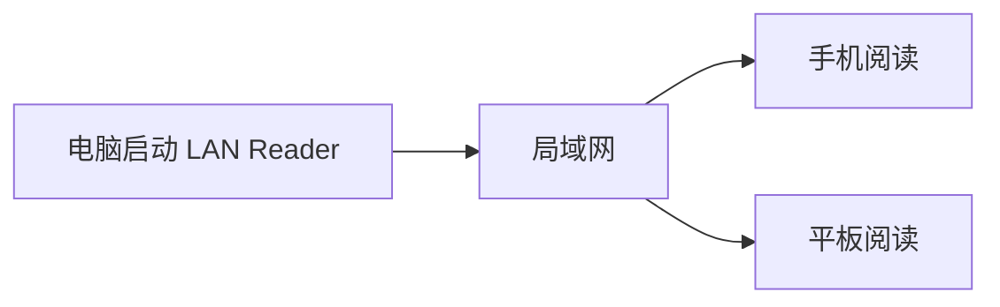

# 欢迎来到局域网书架

这是一份用于体验阅读效果的示例文档。服务运行在你的电脑上，手机和平板只要连接同一个局域网，就可以打开同一座书架。

> 文档不会上传到云端，网页也没有修改或删除文件的能力。

> [!TIP]
> Markdown 图片支持点击放大、全屏和打开原图。

## 阅读体验

左侧是文件夹与文档目录，右侧是当前文章的大纲。屏幕变窄以后，两个目录会自动收进抽屉。

- 支持 **Markdown** 和 GitHub 风格表格
- 支持代码块、任务列表和引用
- 支持 PDF 内嵌阅读
- Word 与 PowerPoint 可通过 LibreOffice 转成 PDF

### 一段示例代码

```js
const address = "http://192.168.1.20:8080";
console.log(`在平板上打开 ${address}`);
```

### Mermaid 流程图



### 数学公式与脚注

局域网中的设备数量可以写成行内公式 $n \ge 1$。[^local]

$$
T_{\text{read}} = T_{\text{network}} + T_{\text{render}}
$$

[^local]: 文档和服务都留在当前电脑上。

### 当前能力

| 类型 | 预览方式 | 是否修改源文件 |
| --- | --- | --- |
| Markdown | 网页排版 | 否 |
| PDF | 浏览器内嵌 | 否 |
| Word / PPT | 临时转 PDF | 否 |

## 下一篇

继续阅读[局域网访问说明](章节/01-局域网访问.md)。
